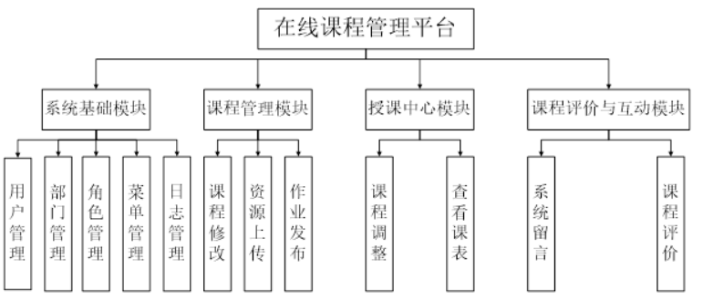
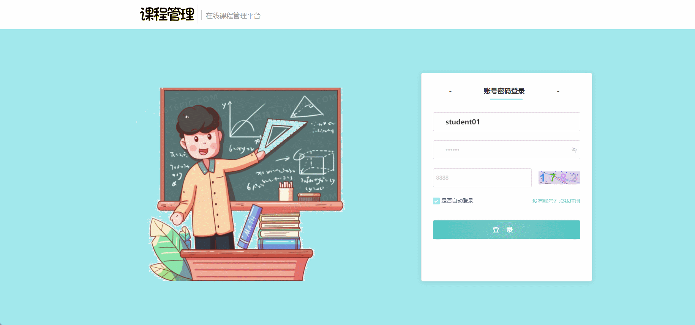
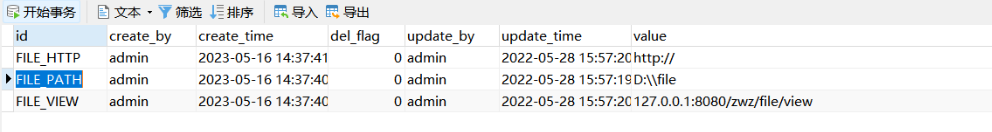

# course-management🎂

基于Spring Boot的在线课程管理系统


## 介绍🌞

> 这一系统充分利用了计算机技术和网络技术，致力于提升教育信息化水平。在技术选型上，该系统后端采用Java结合Spring Boot进行开发，前端则运用了Vue技术，同时选择MySQL作为数据库，保证了系统的稳定性和高效性。该系统不仅实现了课程管理、授课、作业发布、课程评价及互动等核心功能，还特别考虑了教师和学生两大用户群体的实际需求。教师可以通过平台方便地发布课程资源、管理学生和布置作业，而学生则可以轻松查看课程信息、下载学习资料、提交作业，并参与课程评价和互动交流。这一系统的设计充分贴合了教育的实际需求，旨在为用户打造一个功能全面且友好的在线学习环境。为了确保系统的稳定性、可维护性和可扩展性，文档还对系统的需求分析、技术选型、数据库设计以及功能实现等方面做了详尽的说明。借助这一系统，教学效率显著提升，学生的学习体验也更为丰富多彩，充分展现了在线教育的发展潜力和广阔前景。

## 软件架构🌞




## 项目演示🌞

**学生端**




**教师端**


## 安装教程🌞

```
1. 运行环境准备mysql8 + java17 + node14.16.1 + redis

2. 配置maven路径，加载依赖

3. 运行sql文件，确保application.yml或config.properties的数据库名称和账号密码是数据库所在主机的账号密码
```


## 使用说明🌞

```
1. 登入

		管理员账号：admin 密码：123456

        学生账号：student01 密码：123456

        验证码可以为8888（测试用）或者图片显示数字
  
2. 运行流程

SpringBoot+Vue项目的部署详情可以查看这篇CSDN博客：http://t.csdnimg.cn/kpuxS

前后端不分离项目的部署流程可以查看这篇CSDN博客：http://t.csdnimg.cn/CslA5

```

在`a_setting`表中的`FILE_PATH`设置当前服务器的地址




## CSDN项目合集🌞

点击前往：http://t.csdnimg.cn/Q4u84


## 联系我🌞

**有偿获取完整源码或调试代码**

🐧：1902317191

微信：

